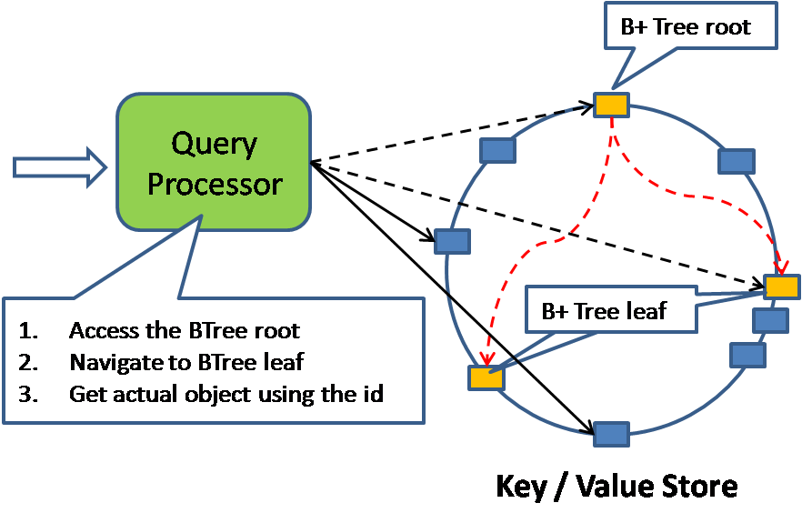

# Basic Concepts, Techniques, and Patterns

- [Consistency](#consistency)
    - [The CAP-Theorem](#the-cap-theorem)
    - [ACID vs. BASE](#acid-vs-base)
    - [Versioning of Datasets in Distributed Scenarios](#versioning-of-datasets-in-distributed-scenarios)
- [Partitioning](#partitioning)
    - [Consistent Hashing](#consistent-hashing)
    - [Read- and Write Operations on Partitioned Data](#read--and-write-operations-on-partitioned-data)
    - [Membership Changes](#membership-changes)
- [Storage Layout](#storage-layout)
- [Query Models](#query-models)
- [Distributed Data Processing via MapReduce](#distributed-data-processing-via-mapreduce)

## Consistency

### The CAP-Theorem

- CAP
    - 일관성 (Consistency)
        - 연산 실행 후의 상태가 일관적인지를 의미함
    - 가용성 (Availability)
        - 클러스터 크래시가 발생한 노드나, 몇몇의 하드웨어나 소프트웨어가 다운됐을 때 연산을 계속해서 수행하도록 설계하고 디자인하는 것 
    - Partition Tolerance
        - 네트워크 파티션이 발생했을 때 시스템이 연산을 계속할 수 있게 하는 능력으로 이해
- 공유 데이터 시스템에서는 세 특성 중 많아봐야 두 특성을 선택할 수 있음
    - ACID와 BASE 시스템 사이에 트레이드오프가 있기 때문
        - 일관성 + partition-tolerance: ACID 특성이 요구됨
        - 가용성 + partition-tolerance: BASE 특성이 요구됨
- 대안, 특성 및 예시
    | Choice                                                   | Traits                                                    | Examples                                                        |
    | -------------------------------------------------------- | --------------------------------------------------------- | --------------------------------------------------------------- |
    | Consistence + Availability (Forfeit Partitions)          | 2-phase-commit, cache-validation protocols                | Single-site databases, Cluster databases, LDAP, xFS file system |
    | Consistency + Partition tolerance (Forfeit Availability) | Pessimistic locking, Make minority partitions unavailable | Distributed databases, Distributed locking, Majority protocols  |
    | Availability + Partition tolerance (Forfeit Consistency) | expirations/leases, conflict resolution, optimistic       | Coda, Web cachinge[sic!], DNS                                   |

### ACID vs. BASE

- 애플리케이션 개수와 사용량이 증가하는 경우
    - 일관성보다 가용성과 partition-tolerance가 더 중요함
    - ACID 특성을 달성하기 어려움
    - BASE를 적용하는 것처럼 접근해야 함
- BASE 접근
    - Basically Available
    - Soft-state
    - Eventual consistency (궁극적 일관성)
- ACID vs. BASE
    | ACID                               | BASE                             |
    | ---------------------------------- | -------------------------------- |
    | Strong consistency                 | Weak consistency – stale data OK |
    | Isolation                          | Availability first               |
    | Focus on "commit"                  | Best effort                      |
    | Nested transactions                | Approximate answers OK           |
    | Availability?                      | Aggressive (optimistic)          |
    | Conservative (pessimistic)         | Simpler!                         |
    | Difficult evolution (e. g. schema) | Faster                           |
    |                                    | Easier evolution                 |
- Strict & Eventual Consistency
    - Strict Consistency: 모든 읽기 연산이, 어느 복제본과도 관계 없이, 반드시 읽기 연산이 완료된 최신으로부터 데이터를 반환해야 함
    - Eventual Consistency: 일정한 상태에서, 시스템이 궁극적으로 마지막으로 기록된 값을 반환해야 함
- Eventual consistent system이 그의 클라이언트에 추가적으로 보장해야 하는 것:
    - Read Your Own Writes (RYOW) Consistency
        - 클라이언트 자신의 업데이트가 완료되면 그 클라이언트에서 바로 업데이트 확인
    - Session Consistency
        - 세션 범위(일반적으로 서버 하나)로 제한되는 자신의 쓰기 일관성을 읽는 것
        - 따라서 클라이언트는 업데이트 후 읽기 요청이 동일한 세션 범위에서 발행 된 경우에만 즉시 업데이트를 확인
    - Casual Consistency
        - 한 클라이언트가 버전 x를 읽은 다음 버전 y를 쓰면, 버전 y를 읽는 모든 클라이언트에도 버전 x가 표시됨
    - Monotonic Read Consistency
        - 클라이언트가 향후 요청에서 더 업데이트 된 버전의 데이터만 볼 수 있도록 시간 단조성을 보장
- Eventual Consistency가 유용한 경우: 동일한 데이터 파티션의 동시 업데이트가 거의 불가능하고 클라이언트가 직접 또는 다른 클라이언트가 발행한 업데이트를 읽는 데 즉시 의존하지 않는 경우

### Versioning of Datasets in Distributed Scenarios

- 엄격한 일관성이 보장되지 않을 때 동시 수정과 버전 문제를 처리하는 옵션:
    - Timestamps
        - 시간 순 개발을 위한 확실한 솔루션
        - 동기화된 클럭에 의존하고 인과관계가 드러나지 않음
    - Optimistic Locking
        - 각 데이터에 대해 고유한 카운터 또는 클럭 값이 저장됨
        - 클라이언트가 데이터 셋을 업데이트하려고 할 때 업데이트하고자 하는 리비전 카운터/클럭 값을 제공해야 함
        - 분산 및 동적 시나리오에서는 제대로 작동하지 않음
            - 전체 버전 번호 순서가 필요하므로 많은 이력이 저장/유지/처리되어야 하기 때문
    - Vector Clocks
        - 순서를 캡처하고 분산 시스템에서 업데이트 간 추론을 허용하는 대체 접근
    - Multiversion Storage
        - 각 테이블 셀의 타임 스탬프를 저장함
            - 실제와 반드시 일치할 필요는 없음
            - 명확한 순서를 인공적인 값일 수 있음
        - 주어진 row에 대해 여러 버전이 동시에 존재할 수 있음
            - 가장 최신 버전 이외의 Reader는 T 이전의 가장 최근 버전을 요청할 수 있음
                - 타임 스탬프 비교 및 스왑을 통한 낙관적 (Optimistic) 동시성 제어를 제공
                - 데이터 세트의 스냅샷을 만들 수 있음

#### 벡터 클럭 (Vector Clocks)

- 정의: 각 노드로부터 클럭 값의 튜플 $ V[0], V[1], ..., V[n] $로 정의됨
    - 분산 사니라오에서 노드 $ i $는, 주어진 클럭에 알고 있는 상태와 다른 (복제본) 노드의 상태를 나타내는 클럭 값의 튜플을 유지함 ($ V_i [0], V_i [1], ..., V_i [i], ..., V_i [n] $ (순서대로 노드의 클럭 값들, 여기서 $ V_i [i] $는 자기 자신))
    - 클럭 값은 한 노드의 로컬 클럭, 버전/리비전 번호나 기타 오디널 (Ordinal) 값으로부터 파생된 실제 타임 스템프일 수 있음
    - 
    - e.g. 노드 번호가 2인 벡터 클럭이 다음의 값을 가질 때: $$ V_2 [0]=45, V_2 [1]=3, V_2 [2]=55 $$
        - 두 번째 노드의 관점에서 그 벡터 클럭이 참조하는 데이터 셋에 대해 다음의 업데이트가 발생했음을 나타냄:
            - 노드 1의 업데이트로 리비전 $ 3 $을 생성함
            - 노드 0의 업데이트로 리비전 $ 45 $을 생성함
            - 노드 2 자체가 가장 최신의 업데이트이며, 그 스스로가 리비전 $ 55 $를 생성함
- 벡터 클럭은 다음의 룰에 따라 업데이트됨:
    - 노드 $ i $에서 내부 연산이 발생하면, 이 노드는 그의 클럭 $ V_i [i] $를 증가시킴
        - 즉, 실행 중인 노드가 내부 업데이트를 즉시 볼 수 있음을 의미함
    - 노드 $ i $가 노드 k에 메시지를 보내면, 자신의 클럭 값 $ V_i [i] $를 먼저 진전시키고 벡터 클럭 $ V_i $ 를 노드 k로의 메시지에 어태치함
        - 이에 따라, 메시지가 보내진 시점에 노드 $ i $가 받는 노드 k에게 내부 상태와 다른 노드에 대한 뷰를 알려 줌
    - 노드 $ i $가 노드 $ j $로부터 메시지를 받으면, 먼저 벡터 클럭 $ V_i [i] $를 진전시킨 후, 그 자신의 벡터 클럭에 노드 $ j $로부터의 메시지에 어태치된 벡터 클럭 $ V_message $를 병합하고 다음을 수행: $$ V_i=max(V_i, \, V_message) $$
        - 부분 순서를 도출하1기 위해 두 벡터 클럭 $ V_i $와 $ V_j $를 비교하기 위해 다음의 룰이 적용됨: $$ V_i > V_j, \, if \, ∀k \, V_i [k] > V_j [k] $$
            - $ V_i > V_j $ 도 아니고 $ V_i < V_j $ 도 아니면, 동시 업데이트로 인한 충돌이 발생한 것이며, 클라이언트 애플리케이션에서 등의 해결이 필요함
- 벡터 클럭은 "복수 복제본에 대한 쓰기 간의 일관성을 해결하기 위해" 활용될 수 있음
    - 업데이트 간에 가볍게(Casual) 추론하는 것을 허용하기 때문
    - 클라이언트는 클라이언트 일관성 모델에 따라 마지막으로 복제한 복제본 노드의 벡터 클럭을 유지함
        - 복제본 노드는 일반적으로, 클라이언트 벡터 클럭을 유지하지는 않음
        - 이 벡터 클럭을 사용하는 방식으로 벡터 클럭 시나리오에 참여하며, 이 모델은 필수적임
            - e.g. 단조로운 읽기 일관성을 위해, 클라이언트는 수신한 마지막 벡터 클럭 요청에 어태치하고, 연결된 복제본 노드는 응답의 벡터 클럭이 클라이언트가 서밋한 벡터 클럭보다 큰지 확인함
        - 이는 클라이언트가 일부 최신 버전의 데이터만 볼 수 있음을 의미함
            - 여기서의 "최신"은 이미 본 버전과 비교하여 새로운 것임을 의미
- 벡터 클럭의 장점 (Timestamps, Optimistic Locking, Multiversion Storage와 비교하여):
    - 동기화된 클럭에 의존하지 않음
    - 가벼운(Casual) 추론에 필요한 리비전 번호의 전체(Total) 순서가 필요하지 않음
    - 데이터의 여러 리비전을 모든 노드에서 저장하고 유지할 필요가 없음

#### 가십(Gossip)을 통한 상태 전달을 위한 벡터 클럭 활용

- 가십 (Gossip) 프로토콜을 통한 벡터 클럭 전송
    - 분할된 데이터페이스에서 복제본들 사이의 충돌되는 버전과 전송 상태에 있을 때, 일관성을 핸들링하기 위한 활용 방안
        - 클라이언트와 데이터베이스 노드 간 벡터 클럭 전송
        - 데이터베이스 노드 간의 복제
        - 읽기 및 업데이트 작업 처리 목적
    - 상태의 노드 간 전파와 관련하여 확장 성을 제공
    - SPOF(Single Point of Failure)를 피함
    - 최종 (Eventual) 일관성만 달성할 수 있음
        - $ n $개의 노드 클러스터에서 상태에 대한 정보가 확산되려면 $ O(log \, ⁡n) $ 라운드가 필요하기 때문
- 상태 전송 모델
    - 클라이언트나 서버 사이에나 서버들 간에, 데이터나, 데이터의 델타(deltas)가 교환됨
    - 데이터베이스 서버 노드는 충돌되는 버전을 위해 그들의 데이터와 상태 버전 트리를 위한 벡터 클럭을 유지함
        - 여기서의 충돌되는 버전은, 해당 벡터 클럭을 $ V_A < V_B $ 또는 $ V_A > V_B $ 관계로 가져올 수 없는 버전을 의미
    - 클라이언트는 그들이 이미 요청하고 업데이트한 데이터 조각을 위해 벡터 클럭을 유지함
- 상태 전송 모델에서의 벡터 클럭의 교환 및 처리 방법
    - 쿼리 처리
        - 
        1. 클라이언트가 데이터를 위해 쿼리할 때, 클라이언트는 그 요청에 따라 요청된 데이터의 그의 벡터 클럭을 보냄
        2. 데이터베이스 서버 노드가, 데이터 조각을 위한 그의 상태 트리의 일부분을 응답함
            - 여기서의 상태 트리 일부분: 클라이언트 요청에 어태치된 벡터 클럭과 그 서버의 벡터 클럭에 선행하는 것
        3. 그 클라이언트는, 서버 응답에 어태치된 서버 노드의 벡터 클럭의 병합에 따라 그의 벡터 클럭을 진행함
            - 이 단계에서, 클라이언트는 또한 잠재적인 버전 충돌을 해결함
                - 클라이언트가 읽기 시간에 충돌을 해결하지 않은 경우, 클라이언트가 접속한 복제본 노드가 유지하는 리비전과 비교된 데이터의 아웃데이트된 리비전에 대한 업데이트를 서밋할 수 있기 때문에 필요함
    - 업데이트 처리
        - 
        1. 읽기 요청의 경우처럼, 클라이언트는 또한, 업데이트 요청에 따라 업데이트될 데이터에 대한 그들의 벡터 클럭을 어태치해야 함
        2. 접속된 복제본 서버는 전송된 벡터 클럭에 따른 클라이언트 상태가 현재 서버 상태보다 우선하고 업데이트 요청을 생략하는지 체크함
            - 이전 단락에서 설명한대로, 클라이언트가 최신 버전을 가져 와서 읽기 시간의 버전 충돌을 수정해야 하기 때문
            - 클라이언트의 전송 받은 벡터 클럭이 자기 자신의 클럭보다 클 경우, 서버는 업데이트 요청을 실행함
    - 노드 간 가시핑 (Gossiping)
        - 
        - 동일한 데이터 파티션을 담당하는 복제본은 백그라운드에서 벡터 클럭과 버전 트리를 교환하고 동기화를 유지하기 위해 병합함
- 연산 전송 모델
    - 로컬에서 유지되는 데이터에 적용 가능한 연산이 이 모델에서 통신(Communicate)됨
    - 명백한 장점은 실제 데이터 또는 데이터의 델타(Deltas)와 달리 연산 교환에 더 적은 대역폭이 소요된다는 점임
    - 각 노드에 올바른 순서로 연산을 적용하는 것이 특히 중요
        1. 복제본 노드는 데이터에 적용하기 전에 (백터 클럭 비교에 따라) 연산 간의 우연한 관계(Casual Relationship)를 결정해야 함
        2. 모든 이전 작업이 실행될 때까지 연산 적용을 지연시켜야 함
            - 이는 지연된 연산들의 큐를 유지하고 다른 복제본의 것들과 교환과 통합을 해야 함을 의미
    - 복제본 노드가 유지해야 하는 벡터 클럭:
        - $ V_state $: 데이터의 마지막 업데이트 상태에 해당하는 벡터 클럭
        - $ V_i $: ($ V_state $ 와 비교하여) 수신된 벡터 클럭과의 병합이 이미 발생한 벡터 클럭 자체
        - $ V_j $: 복제본 노드 $ j $의 마지막 가십 (Gossip) 메시지에 의해 수신된 벡터 클럭 (각 해당 복제본 노드에 의해)
- 상태 전송 모델에서의 벡터 클럭의 교환 및 처리 (읽기/업데이트/노드간 메시지에서)
    - 쿼리 처리
        - 
        1. 읽기 요청에서, 클라이언트는 그의 벡터 클럭을 다시 어태치함
        2. 접촉된 복제본 노드는 클라이언트 요청에 서밋된 벡터 클럭을 인과적으로 따르는 뷰를 가지고 있는지를 판별함
        3. 다음의 상태 중 하나에 대한 최신 뷰로 응답함:
            - 클라이언트에 의해 어태치된 벡터 클럭에 상응하는 상태
            - 해당 노드 차체의 우연하게 (Casually) 이어 받은 벡터 클럭에 상응하는 상태
    - 업데이트 처리
        - 
        1. 클라이언트가 업데이트 요청을 서밋하면, 접촉된 복제본 노드는 이 업데이트 연산을 버퍼링함
            - 유지하는 3 가지의 벡터 클럭과 이미 버퍼링된 연산들의 큐를 고려하여 그의 로컬 상태에 적용될 수 있을 때까지
            - 버퍼링된 업데이트 연산에는 다음의 두 벡터 클럭이 태깅됨:
                - $ V_client $: 업데이트를 서밋할 때 클라이언트 뷰
                - $ V_received $: 업데이트를 받았을 때 복제본 노드의 뷰
                    - 즉, 위에서 언급된 벡터 클럭 $ V_i $
        2. 수신된 업데이트 연산에 우연하게 (Casually) 선행하는 모든 다른 연산들이 도착하여 적용되었을 때, 클라이언트에 의해 요청된 업데이트가 실행될 수 있음
    - 노드 간 가시핑 (Gossiping)
        - 
        - 복제본 노드는 팬딩된 연산의 큐를 교환하고 서로의 벡터 클럭을 업데이트함
        - 노드가 그들의 연산 큐들을 교환할 때마다 노드들은 연산이 그들의 큐에 적용될 수 있는지를 결정함
            - 모든 종속된 연산들이 수신되었므로
        - 한 번에 둘 이상의 작업을 실행할 수 있는 경우, 복제본 노드는, 이 연산들에 어태치된 벡터 클럭에 의해 추론된 올바른 (우연한(Casual)) 순서로 이 연산들을 가져오고, 이를 로컬 데이터 상태에 적용함
        - 다른 복제본들에 대한 동시 업데이트의 경우, 다음과 같은 경우를 구분해야 함:
            - 동시 업데이트가 순서와 상관이 없으면, 적용 순서는 중요하지 않음
            - 동시 업데이트가 순서와 상관이 있으면, 벡터 클럭 비교로부터 추론된 부분 순서가 충분하지 않지만, 전체 순서를 결정해야 함
                - 이를 달성하기 위해 중앙 카운터에서 얻은 글로벌 시퀀스 번호를 활용할 수 있음
        - 연산이 복제본에 로컬로 적용된 경우, 다른 모든 복제본 노드에 업데이트 실행에 대한 정보가 제공된 후에만 노드의 연산 큐에서 제거할 수 있음

## Partitioning

- 데이터 분할 방법을 고려해야 할 시스템
    - 대규모 시스템의 데이터가 단일 머신의 용량을 초과함
    - 신뢰성을 보장하기 위해 복제되어야 함
    - Load-balancing과 같은 스케일링 측정을 허용함
- 데이터 분할에 대한 접근 방식 (시스템의 크기와 역동성(e.g. 스토리지 노드가 얼마나 자주 동적으로 조인하고 떠날 수 있는지)과 같은 기타 요인에 따라)
    - 메모리 캐시 (Memory Caches)
        - Memcached와 같은 메모리 캐시는 파티션된 (일시적이지만) 인메모리 데이터페이스로 볼 수 있음
            - 가장 자주 요청되는 데이터베이스의 부분을 메인 메모리에 복제함
            - 이 데이터를 클라이언트에 신속하게 전달하여 데이터베이스 서버를 대폭 분담함
        - Memcached의 경우 할당된 양의 메모리를 가진 프로세스 배열로 구성됨
            - 네트워크의 여러 머신에서 런칭될 수 있음
            - Configuration을 통해 애플리케이션에 알려짐
        - Memcached 프로토콜은 간단한 키-밸류 스토어 API를 제공함
            - 클라이언트 애플리케이션에서 사용하기 위해 다른 프로그래밍 언어로 구현 가능
            - Configured memcached-instances에 대해 해당 키를 해싱하여 키에 해당하는 객체를 캐시에 저장함
        - Memcached 프로세스가 응답하지 않는 경우, 대부분의 API 구현은 응답이 없는 노드를 무시하고 응답한 노드를 대신 사용함
            - 그들의 일부로서의 캐시 객체의 암시적 Rehashing은 캐시 미스 이후에 다른 서버로 해싱되는 것을 초래함
            - 이전에 응답하지 않은 노드가 Memcached 서버 배열에 다시 참여한 경우:
                - 캐시 누락 이후에 데이터의 일부에 대한 키가 다시 해시됨
                - 해당 노드의 현재 전용 객체는, 노드가 다운된 동안 해시된, 다른 Memcached 서버의 메모리를 암시적으로 남겨 둠
                    - Memcached가 캐시 클리닝에 LRU 전략을 적용하고 추가적으로 캐시 객체에 대한 타임아웃 지정을 허용하기 때문
        - 메모리 캐시의 다른 구현들은 JBoss와 같은 애플리케이션 서버에서 활용 가능함
    - 클러스터링 (Clustering)
        - 단일 서버 대신에 데이터베이스 서버 클러스터와 통신한다는 점에 주목하지 않아야 하는 클라이언트에 대한 투명성(Transparency)을 위한 접근 방안
        - 이 접근 방식은 어느 정도까지 시스템의 영속성 (Persistence) 계층을 확장하는 데 도움이 될 수 있음
        - 클러스터링 기능이 본래 배포용으로 설계되지 않은 DBMS에만 추가되었다는 비판이 많음
    - 쓰기에서 읽기를 분리 (Separating Reads from Writes)
        - 하나 이상의 전용 서버를 지정함
            - 데이터의 전체 또는 일부에 대한 쓰기 작업은 (하나 이상의) 마스터 및 (여러 개의) 읽기 요청 슬레이브를 만족하는 여러 복제본 서버로 라우팅됨
        - 마스터가 클라이언트에 비동기식으로 복제하는 경우
            - 쓰기 지연(lags)이 없음
            - 하나 이상의 클라이언트에 대한 복제를 완료하기 전에 마스터가 충돌하면 쓰기 작업이 손실됨
        - 마스터가 하나의 슬레이브 지연(lags)을 위해 동기식으로 쓰기를 복제하는 경우
            - 업데이트가 손실되지 않음
            - 엄격한 일관성이 필요하며 쓰기 지연을 피할 수 없는 경우 읽기 요청이 슬레이브로 갈 수 없음
            - 마스터가 충돌하면 최신 버전의 데이터가 있는 슬레이브가 새 마스터로 선택될 수 있음
        - 읽기/쓰기 비율이 높으면 마스터/슬레이브 모델이 잘 동작함
        - 데이터 복제는 상태 전송 또는 연산 전송으로 발생할 수 있음
            - 여기서의 상태 전송은, 최신 버전 데이터 복사 또는 이전 버전으로의 델타 (delta) 복사를 의미
            - 여기서의 연산 전송은, 슬레이브 노드의 상태에 적용되며 올바른 순서로 도착해야 함
    - 샤딩 (Sharding)
        - 데이터 분할 방식:
            - 일반적으로 요청되고 업데이트된 데이터가, 동일한 노드에 상주함
            - 로드 및 스토리지 볼륨은 거의 균등하게 분배됨
                - 저장 용량 및 처리 능력과 관련하여
        - 샤딩 시나리오
            - 데이터 샤드는 신뢰성과 Load-Balancing을 위해 복제될 수 있음
            - 전용 복제본 또는 데이터 파티션을 유지하는 모든 복제본에만 쓰기할 수 있도록 허용할 수도 있음
        - 샤드와 스토리지 노드 간의 매핑
            - 샤딩 시나리오가 가능하려면 데이터 파티션(샤드)과, 이러한 샤드에 응답 가능한 스토리지 노드 간에 매핑이 있어야 함
            - 이 매핑은 다음 중 어느 것에 따라 정적이거나 동적일 수 있음:
                - 클라이언트 애플리케이션의 결정에 따라 
                - 일부 전용 매핑 서비스나 컴포넌트에 따라
                - 몇몇의 클라이언트 애플리케이션과 스토리지 노드 간의 Network Infrastructure에 따라
        - 샤딩 시나리오의 단점
            - 데이터 샤드 간의 조인이 불가능함
                - 이 때문에 데이터베이스 내부 또는 외부의 클라이언트 응용프로그램이나 프록시 레이어가, 여러 요청과 Postprocess (e.g. Filter, Aggregate) 결과를 대신 발행(Issue)해야 함
            - Lipcon's comments: "you lose all the features that make a RDBMS useful" and that sharding "is operationally obnoxious".
                - 샤딩이 본래 현재의 RDBMS 내에서 설계된 것이 아니라 오히려 상단에 추가된 사실을 의미함
                - 반대로, 많은 NoSQL 데이터베이스는 샤딩을 주요 기능으로 채택함
                    - 일부는 자동 파티셔닝과 노드 간의 데이터 밸런싱도 지원함
                        -  e.g. MongoDB (version 1.6)
- 데이터베이스 객체를 서버에 매핑하는 방법
    - 명백한 접근 방법: $$ partition=hash(o) \; mod n \quad with \, o=object \, to \, hash, \, n=number \, of \, nodes $$
        - 사용 가능한 데이터베이스 노드 세트에 대한 데이터베이스 객체 기본 키를 해싱함
        - 이 프로시저의 단점은 노드가 떠나고 조인할 때마다 적어도 데이터의 일부를 재분배해야 한다는 점임
    - 메모리 캐싱 시나리오에서 암묵적으로 데이터 재분배가 발생할 수 있는 경우:
        - 캐시 미스 확인
        - 데이터베이스나 백엔드 시스템으로부터 데이터를 다시 읽음
        - 현재 가용한 캐시 서버에 반하여 해시함
        - 캐시 서버에서 오래된 캐시 데이터를 제거함
            - LRU와 같은 일부 클리닝 정책에 따라
    - 영구적인 (Persistent) 데이터 스토어에 대해서는 암묵적인 재배포 프로세스가 허용되지 않음
        - 사용 가능한 노드에 없는 데이터를 재구성할 수 없으므로
        - 이 경우, 일관된 해싱(Consistent Hashing)과 같은 다른 접근법이 필요함
            - 노드들이 런타임에 조인하고 떠날 수 있는 환경에서
                - e.g. 노드 크래시, 일시적인 Unattainability, 유지 작업

### Consistent Hashing

- 캐싱 프로토콜 패밀리 (Family of Caching Protocols)
    - 1997년 David Karget 등이 "네트워크에서 Hot Spot 발생을 줄이거나 제거하는 데 사용할 수 있는 분산 네트워크용 캐싱 프로토콜의 패밀리"에 관한 논문에서 도입함
    - 캐싱 프로토콜의 패밀리는, 1997년 이후로부터 캐싱 네트워크 프로토콜 이외의 다른 분야에서 채택된 일관된 해싱을 기반으로 함
        - e.g. 분산 해시 테이블 구현
            - Chord
            - 일부 Memcached 클라이언트: 데이터베이스에 integrated된 NoSQL Scene
                - Amazon's Dynamo
                - Project Voldemort
- 기본 아이디어와 장점
    - 동일한 해시 함수를 사용하여 객체와 캐시를 모두 해시함
    - 머신 입장의 장점 (해시 객체뿐만 아니라):
        - 머신이 해시 함수 범위의 인터벌을 얻을 수 있음
        - 인접한 머신은 이웃의 간격의 이웃 노드가 떠나면 이웃의 인터벌의 일부를 인계 받을 수 있음
        - 새 노드가 조인하고 인접한 인터벌에 매핑되면 자신의 인터벌의 일부를 제거할 수 있음
    - 추가적인 장점:
        - 클라이언트 애플리케이션이 데이터를 요청하거나 쓰기할 목적으로 연결 대상 노드를 계산할 수 있음
        - 메타 데이터 서버가 불필요함
            - 즉, GFS (Google File System) 같은 게 필요하지 않음
                - GFS: 스토리지 서버와 데이터 파티션 간의 매핑이 포함된 (클러스터된) 중앙 메타 데이터 서버가 있음
- 접근 방식 (아이디어)
    - 초기 상황
        - 
        1. 3개의 빨간색 노드 A, B, C와 4개의 파란색 캐시 객체 1-4가, 해시 함수 결과 범위(위 그림에서 링 위로 가정)에 매핑됨
        2. 링을 따라 시계 방향으로 이동하여, 어떤 노드에 어떤 캐시 객체가 매핑되는지 결정됨
            - 객체 4, 1 -> 노드 A
            - 객체 2 -> 노드 B
            - 객체 3 -> 노드 C
    - 노드가 조인하고 떠난 상황
        - 
        1. 노드가 시스템을 떠나면, 캐시 객체는 인접한 노드에 시계 방향으로 매핑됨
        2. 노드가 시스템에 들어가면, 캐시 객체는 링에 해시되고 객체를 앞지를 것임
            - 노드 C가 떠나고 노드 D가 들어온 후: 객체 3, 4 -> 노드 D
        - 이는, 노드 개수가 바뀌면 일부만 리매핑할 수 있음을 보여줌
            - 모든 캐시 객체를 새로운 노드 세트로 리매핑하지 않아도 됨
- 위 아이디어의 문제점과 해결 방법
    - 실제로는 링 위의 노드 분포가 랜덤한 문제가 있음
        - 위치가 해시 함수에 의해 결정되고 노드 간 간격이 "불균등"할 수 있기 때문
        - 이 때문에, 결과적으로 이러한 노드들에서 캐시 오브젝트의 불균등 분배가 발생함
            - 위 그림을 예시로 들면, 노드 D가 노드 A나 노드 B보다도 먼 곳에서 캐시 객체를 가져와야 함
    - 링 위의 각 물리적 노드에 대한 여러 대표/복제본(가상 노드라고도 함)을 해시하여 위 문제를 해결할 수 있음
        - 
        - 실제의 가상 노드 개수는 하드웨어 용량(CPU, 메모리, 디스크 용량)에 따라 개별적으로 정의할 수 있음
        - 모든 물리적 노드에 대해 동일할 필요는 없음
        - e.g. 노드의 ID에 대한 복제 카운터가 해시되면, 이 가상 노드들은 이 노드에 대한 포인트를 링 전체에 분배해야 함
        - 10개의 물리적 노드에 10,000개의 객체를 분신시키도록 시뮬레이션했을 때, 객체 분포의 표준 편차 변화 (가상 노드가 없을 때를 100%라 하면):
            - 각 물리적 노드 당 가상 노드 2-5개: 50%로 감소
            - 각 물리적 노드 당 가상 노드 500개: 5-10%로 감소
- 영구 (Persistent) 스토리지에 적용할 때의 추가적인 문제점과 해결 방법
    - 노드가 Scene을 떠나면, 그 이전에 다른 노드로 복제되지 않는 한, 이 노드에 저장된 데이터를 사용할 수 없는 문제가 있음
        - 이와 반대로, 새로운 노드가 다른 노드와 조인하는 경우, 인접한 노드가 여전히 저장하고 있는 데이터의 일부분에 대해, 인접한 노드는 더 이상 응답하지 않음
            - 클라이언트 요청에 따라 해당 객체가 더 이상 인접 노드에 해시되지 않기 때문에 더 이상 요청 받지 않음
    - 복제 펙터 ($ r $)을 도입하여 해결할 수 있음
        - 그 다음 노드뿐만 아니라 시계 방향의 그 다음 (물리적인!) $ r $ 노드들이 객체에 응답하게 됨
        - 복제된 데이터가 있는 시나리오 예시:
            - 
            1. 링 위의 대문자는 - 가상 노드의 아이디어에 따라 - 다중 매핑된 스토리지 노드를 나타냄
            2. 화살표가 있는 원은 표시된 위치에서 링에 매핑된 데이터 객체를 나타냄
            3. 이 예시에서 복제 펙터는 3이므로, 모든 데이터 객체에 대해, 그림에서 대괄호 안에 나열된 3개의 물리적 노드가 응답함
        - 복제본을 도입하면 데이터 파티션에 대한 읽기 및 쓰기 작업이 수행됨

### Read- and Write Operations on Partitioned Data

- 파티셔닝 스킴에서의 복제본 도입의 장점 (신뢰성에 대한 이점 이외에도)
    - 읽기 요청에 대한 워크로드를 분산시킬 수 있음
        - 요청된 일부 데이터에 응답하는 모든 물리적 노드로 갈 수 있는 읽기 요청
- 로드 밸런싱 읽기 연산은 다음의 시나리오에서 적용되지 않음:
    - 클라이언트가 여러 버전의 데이터 세트 중에 결정해야 하는 경우
        - 서버들의 Quorum에서로부터 읽어야 하므로 로드 밸런스 읽기 요청을 읽는 능력(ability)이 줄어 들기 때문
- 읽기 및 쓰기 연산에서 중요한 세 가지 파라메터 (Project Voldemort team points ...)
    - **N**: 읽거나 쓸, 데이터의 조각이나 데이터에 대한 복제본의 개수
    - **R**: 읽기 연산에 연결된 머신 개수
    - **W**: 쓰기 연산에서 차단해야 하는 머신 개수
        - 클라이언트가 연산의 성공을 보장하지 않는 논블로킹 방식으로 쓰기하는 경우 0이 될 수 있음
    - read-your-own-writes 일관성 모델 등을 제공하기 위해, 위 파라메터 사이에 다음의 관계가 필요함: $$ R+W>N $$
- 쓰기 연산과 관련하여, 클라이언트가 다음과 같이 즉각적으로 일관성이 없거나 분리되지 않아야 함:
    - 쓰기 작업이 오류나 예외 없이 완료되면, 클라이언트가 최소한 W 노드들이 연산을 실행했는지 확인할 수 있음
    - W 노드보다 적은 개수의 쓰기 연산을 수행하는 등 쓰기 연산을 실패하면, 데이터 세트의 상태는 지정되지 않음
        - 적어도 하나의 노드가 성공적으로 쓰면, 그 값은 결국 모든 복제본 노드에서 새로운 값이 됨
            - 복제본 노드들은 값을 교환하고, 백그라운드에서 최신 버전의 데이터 세트에 동의함
        - 새 값을 쓸 수 있는 서버가 없으면, 그 값은 손실됨
        - 쓰기 작업을 실패하는 경우, 클라이언트가 쓰기 연산을 재발행해야만 일관성이 있는 상태를 이룰 수 있음

### Membership Changes

- 멤버십이 변경될 때 특히 모든 노드가 서로 통신해야 함
    - 노드가 그의 연산에 영향을 주지 않고 언제나 시스템에 조인하고 떠날 수 있는 파티션된 데이터베이스에서
- 새 노드가 시스템에 조인할 때의 조치 사항:
    1. 새로 도착한 노드는 자신의 존재 여부와 식별자를 브로드캐스트를 통해 인접 노드 또는 모든 노드에 알림
    2. 조인하는 노드의 인접 노드는 그들의 객체 및 복제본 소유권을 조정하여 반응함
    3. 조인하는 노드는 이제 인접 노드의 데이터 세트를 복제함
        - 벌크로 수행될 수도 있고 비동기적으로 수행될 수도 있음
    4. 1 단계에서 멤버십 변경이 모든 노드에 브로드캐스트되지 않은 경우, 조인하는 노드는 이제 도착을 알림
    - 2 단계와 3 단계에서 데이터 전송 및 범위 조정이 발생하지만, 새 노드의 인접 노드는 여전히 요청 받을 수 있고 데이터를 새로운 노드로 포워딩할 수도 있음
        - 요청된 데이터의 일부를 이미 받은 경우
        - 벡터 클럭을 클라이언트로 보낼 수 있는 경우
            - 여러 복제본을 접한 후에 최신 버전의 데이터 셋을 클라이언트들이 결정하도록 하기 위해
- 새 노드가 시스템에 조인할 때의 예제:
    - 
    1. 노드 X가 복제 펙터가 3으로 구성된 시스템에 조인함
    2. 노드 X가 A와 B 사이에 해시됨
    3. 노드 H, A, B는 데이터를 새 노드 X로 전송함
    4. 노드 B, C, D는, 노드 X가 현재 세 번째 복제본으로 담당하는, 그들의 데이터 일부를 드랍할 수 있음 (노드 H, A, B 이외에)
- 노드가 시스템을 떠날 때의 조치 사항:
    1. 시스템 내의 노드는, 노드가 크래시가 발생하여 다른 노드에 이탈을 통지할 수 없었던 상태로 남아 있는지의 여부를 감지해야 함
        - 많은 시스템에서 노드가 떠날 때 알림이 교환되지 않는 게 일반적임
        - e.g. 시스템의 노드가 가십 프로토콜을 통해 정기적으로 통신하는 경우 더 이상 응답하지 않기 때문에 노드의 이탈을 감지할 수 있음
    2. 노드의 이탈이 감지되면 해당 노드의 인접 노드는 서로 데이터를 교환하고 객체 및 복제본의 소유권을 조정하여 반응해야 함
- 노드가 시스템을 떠날 때의 예제:
    - 
    1. 크래시로 인해 노드 B가 시스템을 떠남
    2. 노드 C, D, E가 반시계 방향으로 노드들로부터 데이터를 복사해야 함
        - 해시된 객체의 새로운 인터벌을 담당하게 되었기 때문
    3. 노드 C, D, E의 인터벌의 내부 표현을 재구성해야 함
        - $ Range_{AB} $와 $ Range_{BC} $가 이제 $ Range_{AC} $로 축소되었기 때문

## Storage Layout

- 스토리지 레이아웃이 중요한 이유
    - 성능과 직접적으로 관련됨
        - 디스크 엑세스 방식을 결정하기 때문
    - 어떤 종류의 데이터를 빠르게 읽을 수 있을지 정의함
        - 데이터 종류: 전체 로우, 전체 컬럼, 컬럼의 하위 셋
- 스토리지 레이아웃의 종류
    - Row-Based Storage Layout
        - 
        - 관계형 모델의 테이블이 해당 라인이 어팬드되고 디스크에 플러시됨에 따라 직렬화됨
        - 장점:
            1. 단일 IO 작업으로 전체 데이터 세트를 읽고 쓸 수 있음
            2. 다른 컬럼의 캐시와 디스크에 엑세스하기 좋은 위치
        - 단점:
            - 컬럼을 연산하는 데 비용이 비쌈
                - 상당한 양의 데이터(나이브한 구현에서는 모든 데이터)를 읽어야 하기 때문
    - Columnar Storage Layout
        - 
        - 컬럼을 어팬드하고 디스크에 플러시하여 테이블을 직렬화함
        - 장점:
            - 컬럼에 대한 연산이 빠르고 저렴함
        - 단점:
            - 로우에 대한 연산의 비용이 비쌈
            - 모든 컬럼에서 탐색(seek)을 유발할 수 있음
        - 일반적인 응용 분야:
            - 통계 목적을 위해 효율적인 컬럼 검사가 중요한 경우
    - Columnar Storage Layout with Locality Groups
        - 
        - Column-Based Storage와 비슷하지만, 클라이언트와 함께 엑세스할 것으로 예상되는 컬럼 그룹(소위, 지역 (Locality) 그룹)을 정의하는 기능이 추가됨
            - 이러한 그룹의 컬럼들은 함께 저장되어, 다른 컬럼과 컬럼 그룹과 물리적으로 분리될 수 있음
            - 지역 (Locality) 그룹에 대한 아이디어는 Google의 Bigtable 논문에 소개됨
                1. 의미상의 Affine 또는 밀접하게 관련된 컬럼들에 대한 컬럼 패밀리의 논리적 모델
                2. 물리적 스토리지를 위해 컬럼 패밀리를 그룹화하거나 분리할 수 있는 개선된 지역 (Locality) 그룹 아이디어
        - Log Structured Merge Trees (LSM-trees)
            - 위의 스토리지 레이아웃들과 달리, 논리적 (테이블, 도큐먼트 등의) 데이터 구조를 직렬화하는 방법을 기술하지 않지만, 성능적이고 여전히 안전함
                - 효율적인 읽기 쓰기 요청을 충족시키기 위해 메모리와 디스크 스토리지를 효율적으로 사용함
            - O'Neil 등이 제시한 아이디어 (1996년)
                - 메모리(소위, Memtables)에 데이터 청크(Chunks)를 저장함
                - 이러한 인메모리 데이터 구조에 대한 온디스크 (On-Disk) 커밋 로그 유지
                    - 
                - 때때로 그 Memtables를 디스크(소위, SSTables)로 플러시함
                    - 
                - SSTables는 시간이 지남에 따라 불변이 되고 압축됨
                    - 
                    - 원본 SSTable을 유지하면서 압축된 SSTable을 디스크의 다른 영역에 복사하고, 압축 프로세스가 발생한 후 원본 SSTable을 제거
                    - 이러한 SSTable에 저장된 데이터가 클라이언트에 의해 변경되었거나 삭제되었을 수 있기 때문에 압축이 필요함
                    - 이러한 데이터의 수정은 먼저 Memtable에 반영되어, 나중에  디스크 전체적으로 (SSTable로) 플러시됨
                        - 이미 디스크에 있는 다른 SSTable과 함께 압축될 수 있음
                - 읽기 요청은 요청된 데이터가 포함된 SSTable과 Memtable로 이동하여 병합된 뷰를 반환함
                    - 
                - 읽기 요청을 최적화하고 관련 SSTable만 읽으려면 Bloom Filters6를 사용할 수 있음
                    - 
                - 쓰기 요청은 온디스크 커밋 로그뿐만 아니라 Memtable에도 동기적으로 전달됨
                    - 
    - 장점:
        - 읽기 요청을 빠르게 충족시키고, 디스크 I/O가 더 빨라짐
            - SSTable을 순차적으로 읽을 수 있기 때문
            - 데이터가 디스크에 무작위로 분산되지 않기 때문
        - 머신 크래시에 내성이 있음
            - 쓰기 연산이 메모리로 이동할 뿐만 아니라 머신이 크래시로부터 복구할 수 있는 커밋 로그로 (동기적으로) 이동하기 때문
    - Google Bigtable 예제 (Blogger Ricky Ho Summarizes ...)
        - 
- 온디스크나 인메모리 스토리지, 또는 둘의 조합에 대한 논의 (Blogger Nati Shalom Notes and Cites ...)
    - 대부분의 데이터의 GB 당 비용(cost/GB)은 읽기/쓰기 성능으로 나타남
    - 비용도 성능의 함수(한 요소)임
        - Stanford 大의 "The Case for RAMClouds"라는 분석에서 얻은 결론 
        - RAM-Cloud는, 애플리케이션이 많은 양의 데이터를 저렴하게 저장해야 하고 엑세스 속도가 상대적으로 낮은 경우에는 최고의 솔루션이 아님
        - RAM-Cloud는, 시스템의 처리량이 높으면 고성능뿐만 아니라 에너지 효율성도 제공할 수 있음
- 스토리지 레이아웃의 분류 위에 추가된 플러그인 (Blogger Ricky Ho Adds ...)
    - 일부 NoSQL 데이터베이스는 스토리지 구현을 열어 두고 다양한 종류의 플러그인을 허용함
        - 관계형데이터베이스, 키/밸류 데이터베이스, BerklyDB, 파일 시스템 또는 메모리 해시 테이블 등을 스토리지 구현할 수 있는 사용할 수 있는 Project Voldemort와 같은 플러그인
    - 대부분의 NoSQL 데이터베이스는 특정 특성에 최적화된 스토리지 시스템을 구현함
    - 대부분의 데이터베이스는, 위와 같은 점 이외에도, 특정 데이터 모델, 쿼리 처리 수단, 인덱싱 구조 등에 따라 최적화를 수행함
- CouchDB 예제
    - CouchDB
        - 도큐먼트 데이터베이스
        - 데이터베이스 내용에 대한 어팬드만 가능한 파일과의 조합으로 Copy-on-Modified 시맨틱을 제공함
    - Copy-on-Modified Semantic
        - 
        - 수정 요청을 발행한 사용자의 프라이빗 사본이 인덱스(CouchDB의 경우 B-Tree)뿐만 아니라 데이터로부터 만들어짐을 의미
            - CouchDB는, 발행자에게 Read-Your-Own-Writes 일관성을 제공할 수 있음
            - 다른 클라이언트만 수정 사항을 볼 수 있음
        - 프라이빗 사본은 복제 노드로 전파됨
        - 새로운 버전이 모든 클라이언트에 대해 유효해지기 전에 클라이언트가 충돌하는 버전을 병합해야 할 수도 있음
            - CouchDB가 다중 버전 동시성 제어(MVCC)도 지원하기 때문
            - 위 그림과 같이, B-Tree로 구성된 스토리지 메타 데이터의 루트 포인터를 교체하면 됨
    - Append-Only Fashion
        - CouchDB는 디스크에 대한 모든 업데이트를 어팬드만 가능한 방식으로 동기식으로 유지함
    - Garbage-Collection
        - 압축된 파일 내용을 새 파일로 복사하고, 새 파일이 올바르게 쓰기될 때까지 이전 파일을 건드리지 않고 지속적으로 데이터를 압축함
        - 이 처리는 GC가 실행되는 동안 시스템의 지속적인 연산을 허용함

## Query Models

- NoSQL 데이터 스토어가 제공하는 쿼리 기능은 상당한 차이가 있음 (Blogger Nati Shalom Notes ...)
    - 키/밸류 스토어는 프라이머리 키 또는 일부 ID 필드만 조회할 수 있고 추가 필드를 쿼리하는 기능이 없는 경우가 종종 있음
    - 도큐먼트 데이터베이스인 CouchDB와 MongoDB와 같은 데이터 스토어는 복잡한 쿼리를 허용함
        - (CouchDB에서와 같이) 데이터베이스 노드에서 사전에 정의된 정적 쿼리
    - 많은 NoSQL 데이터베이스 설계에서 리치한 동적 쿼리 기능이 성능과 확장성을 위해 생략됨
- NoSQL 데이터 스토어에서 직접적으로 제공하지 않는 쿼리 기능을 구현하는 몇 가지 방법 (Blogger Ricky Ho's post "Query processing for NoSQL DB"):
    - Companion SQL-database
        - 
        - 검색 가능한 속성(Searchable Attributes)을 SQL 또는 텍스트 데이터베이스에 복사하는 접근 방식
        - 이 쿼리 기능은, NoSQL 데이터베이스에 엑세스할 수 있는, 매칭되는 데이터 세트의 기본 키를 검색하는 데 사용됨
    - Scatter/Gather Local Search
        - 
        - NoSQL 스토어가 데이터베이스 서버 노드 내에서 쿼리 및 인덱싱을 허용하는 경우에 사용할 수 있음
        - 이 경우, 쿼리 프로세스는, 쿼리가 로컬에서 실행되는 데이터베이스 노드로, 쿼리를 디스패치할 수 있음
        - 모든 데이터베이스 서버로부터의 결과는 쿼리 프로세서로 다시 전송됨 (are sent back)
            - 여기서 쿼리 프로세서의 역할:
                - 서버로부터의 결과 후처리 (e.g., 일부 Aggregation)
                - 쿼리를 발행한 클라이언트에게 결과를 반환
    - Distributed B+ Trees
        - 
        1. 분산된 B+ 트리의 루트 노드를 찾기 위해 (to locate) 검색 가능한 속성(Searchable Attribute)을 해시함
            - 확장 가능하고 분산된 B+ 트리에 대한 자세한 내용은 Microsoft, HP, Toronto 大의 논문 참조
        2. 그 다음, 이 루트 노드의 "값"은 트리에서 다시 조회(look up)될 수 있는 Child 노드의 ID를 포함함
        3. 이 프로세스는, 프라이머리 키 또는 Search Criteria와 일치하는 NoSQL 데이터베이스 엔트리의 ID를 포함하는 리프 노드에 도달할 때까지 반복됨
        - 분산 B+ 트리에서의 노드 업데이트는 반드시 신중하게 처리(Handle)되어야 하며, 원자적인 (Atomic) 방식으로 처리(Handle)되어야 함 (Ho Notes ...)
    - Prefix Hash Table (aka Distributed Trie)
        - 
        - 루트 노드에서 리프까지의 모든 패스(path)에 키의 접두사를 포함함
        - 그 Trie의 모든 노드에는 키가 접두어로 붙은 모든 데이터를 포함함
        - 더 많은 정보는 Berkley 논문 참조
- Search Criteria에서의 Junctions는, 분산과 관련한 접근 방식(Scatter/Gather Local Search, Distributed B+ Trees)을 쿼리할 때, 명시적으로 해결되어야 함 (Ho Furthermore points out ...):
    - OR-Junctions
        - 다른 데이터베이스 노드들을 Union 연산으로 결합할 수 있으므로 간단함
    - AND-Junctions
        - 개별적으로 매칭되는 Criteria의 Intersection이 필요하기 때문에 더 어려움
            - 따라서 잠재적으로 큰 세트를 Intersect하는 효율적인 방법이 필요함
        - 나이브한 구현에서는, 매칭되는 모든 객체를, 세트의 Intersection을 수행하는 서버로 보내게 할 수도 있음
            - e.g. Companion SQL-database, Scatter/Gather Local Search, Distributed B+ Trees 등에서의, 분산된 쿼리를 착수하는 쿼리 프로세서
                - 위 구현 방법 중 Prefix Hash Table을 제외한 그림들 참조
            - 일부 또는 모든 데이터 세트가 큰 경우, 대역폭 소요가 큼
        - 보다 효율적인 여러 가지 접근 방식 (Reynolds와 Vahdat의 논문):
            - Bloom 필터는 (결과) 세트에 포함되어 있지 않는지 테스트하는 데 사용할 수 있음
                - 네트워크를 통해 전송되거나 Bloom 필터보다 비싼 계산(Computation)으로 비교되어야 하는 요소의 수를 크게 줄일 수 있음
            - 자주 검색되는 (Popular) 특정 검색 결과 세트나 자주 검색되는 (Popular) Search Criteria의 Bloom 필터는 캐시될 수 있음
            - 클라이언트 애플리케이션이 한 번에 전체 결과 세트를 요구하지 않는 경우, Incremental 페치 전략이 적용될 수 있음
                - Cursor 모드를 사용하여 결과 세트 데이터가 클라이언트로 스트리밍되는 경우
                - 이 전략이 적용되면, 계산(Computation)이 클라이언트 애플리케이션으로 이동함
                    - 여기서 클라이언트 애플리케이션은, 세트 Intersection과 같은 필터링 연산을 담당하게 될 수도 있음

## Distributed Data Processing via MapReduce

- 동적 쿼리 메커니즘에 집중되어 분산 환경에서 작동하는 방법
    - MapReduce 방식으로 분산된 데이터베이스 노드에서 작동할 가능성이 있음
        - 쿼리 및 유지 보수 능력의 Lacking에 대한 대체 방법은 없음
            - as Brian Aker correctly humorously argues in his talk "Your Guide To NoSQL"
    - 이 접근은, 테스크를 두 스테이지로 나누며, map과 reduce 함수로 기술됨 (Brought up by Google Employees in 2004):
        - 
        - 조정자(Coordinator)는, 주어진 map 함수를 실행하고 중간 출력을 생성하는, 여러 노드를 처리할 데이터 조각을 지정함
        - 중간 출력은 주어진 reduce 함수를 실행하는 다수의 머신에 의해 처리됨
            - 중간 결과로부터 최종 출력을, 일부 aggregation 등에 의해, 생성하는 것이 목적
        - 동일한 입력 데이터가 주어지면 각 실행 환경에서 동일한 출력을 생성함
            - map과 reduce 함수 모두, 실행되는 머신의 상태에 의존하지 않음
                - 이 함수들이 실함수적인 방식으로 이해되어야 하기 때문
        - 조정자(Coordinator)는, Google의 원본 논문에 따라, 중간 데이터의 할당뿐만 아니라 원래 데이터의 분할을 수행함
- MapReduce 패러다임
    - 많은 프로그래밍 언어(e.g. Python), 프레임워크(e.g. Apache Hadoop), 심지어 JavaScript 툴킷(e.g. Dojo)과 NoSQL 데이터베이스(e.g. CouchDB)에서도 채택됨
        - 분산 처리(As Blogger Ricky Ho notes ...), 특히 분석 용도 또는 사전 계산 테스크(e.g. CouchDB에서 데이터의 뷰 생성)에 적합하기 때문
    - 데이터베이스에 적용될 때, MapReduce는 프로세스 로직(map 함수와 reduce 함수 코드)을 스토리지 노드에 서밋하여 키 세트를 처리하는 것을 의미함
        - 여기서 프로세스 로직은, 처리되어야 하는 키와 소유해야 하는 키에 map 함수를 로컬로 적용함
    - 중간 결과는 정규 데이터처럼 일관되게 해시하고, 다음 노드에서 시계 방향으로 처리하여, 중간 결과에 reduce 함수를 적용하고 최종 결과를 생성할 수 있음
    - 중간 결과를 일관되게 해싱함으로써, 조정자(Coordinator)가 필요 없음
        - 프로세싱 노드에게 어디를 찾을 수 있는지 알려주는 데 필요한 조정자(Coordinator)가 필요하지 않음
    - 분산 데이터 스토어에 MapReduce를 적용하는 아이디어
        - 
